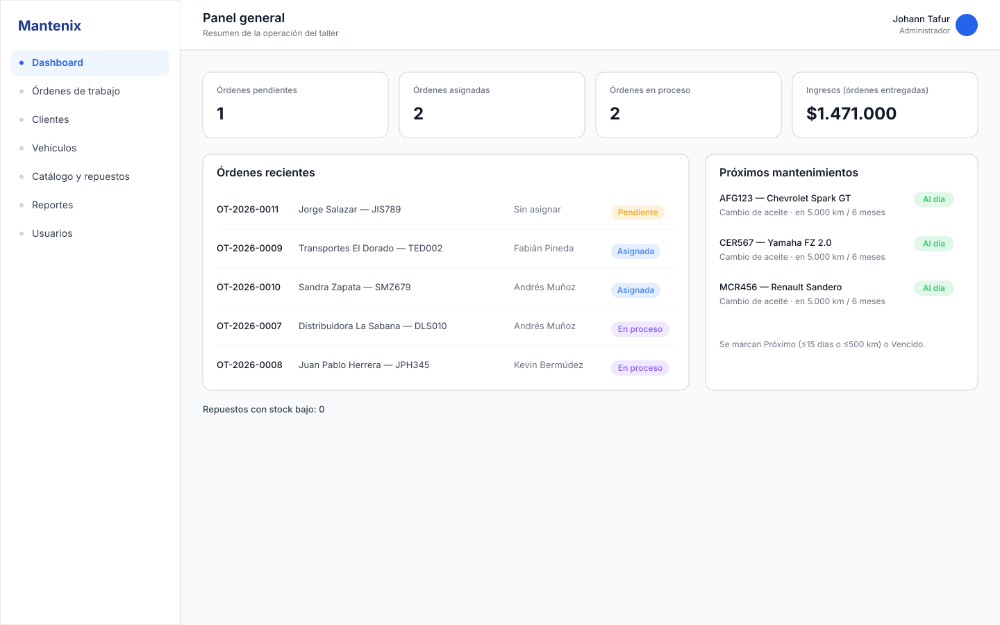
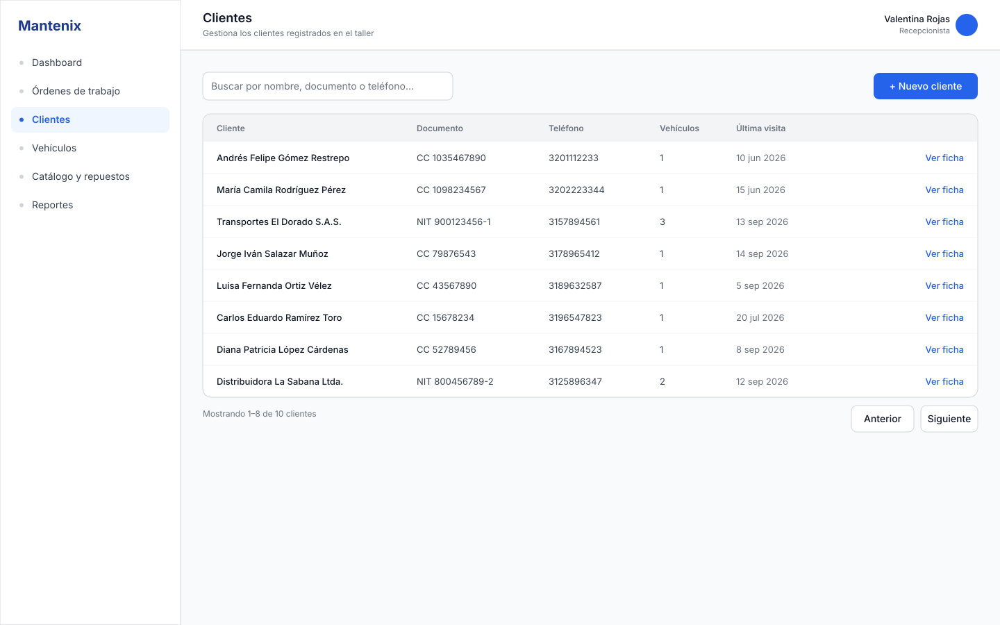
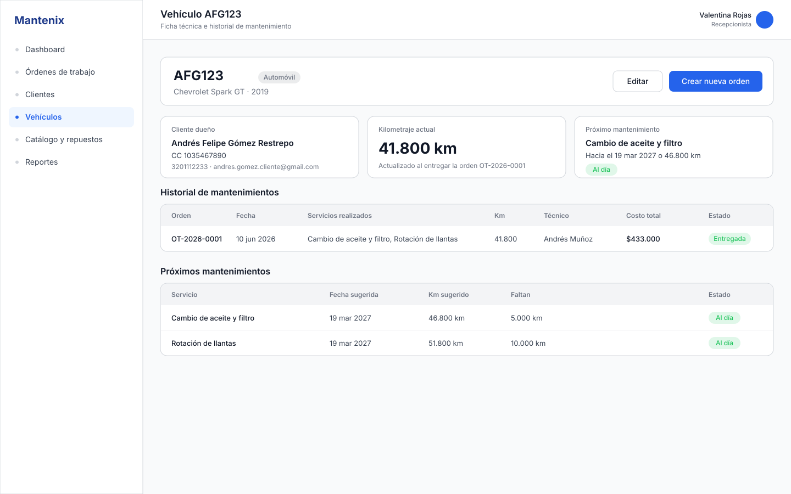
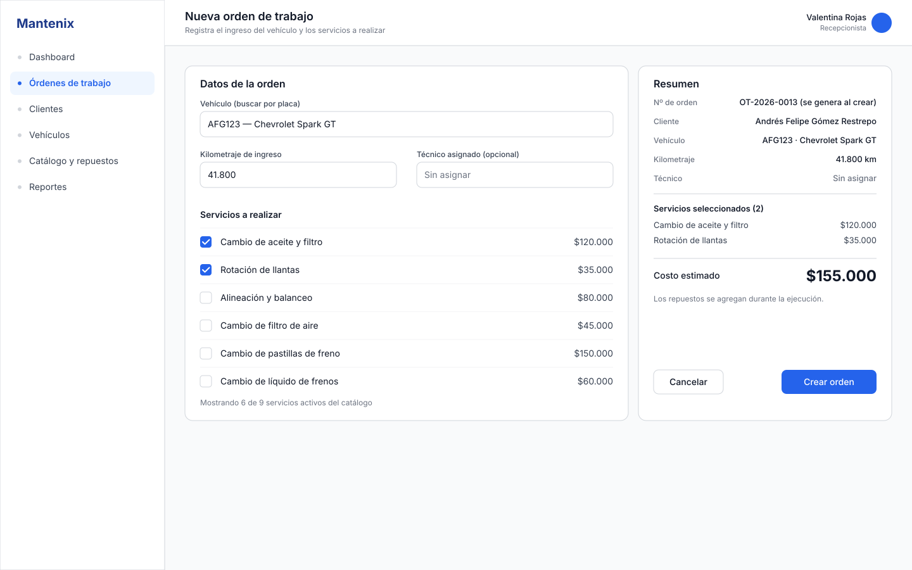
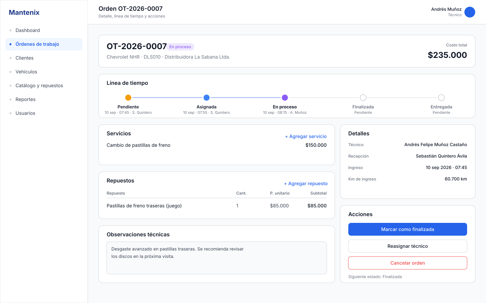
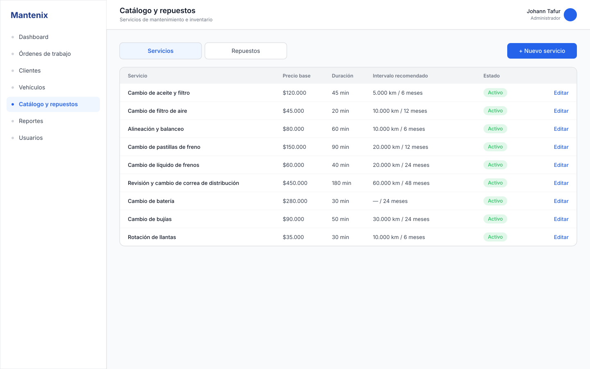
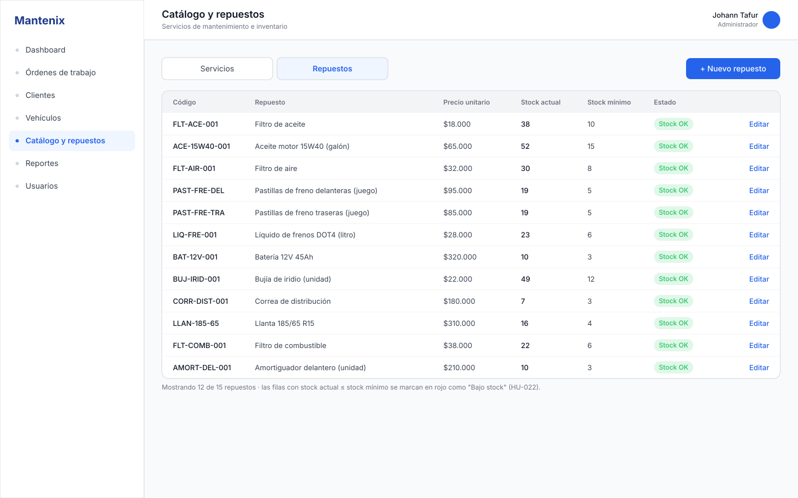

# Mockups de pantallas (SVG)

Pantallas de 1440×900 en el mismo estilo del sistema de diseño de Figma (paleta, tipografía Inter,
componentes Button/Badge/Input/NavItem). Todos los datos salen de [database/seed.sql](../../../database/seed.sql):
mismos clientes, placas, órdenes, precios, stock y fechas, así que las pantallas son coherentes con la base de datos.

Se generaron localmente porque el plan Starter de Figma limita las llamadas del MCP; los SVG se pueden
**arrastrar directamente a Figma** (se importan como capas editables) o usarse como evidencia.

| Archivo | Pantalla | Historias de usuario |
|---|---|---|
| [02-dashboard.svg](02-dashboard.svg) | Dashboard del administrador | HU-034, HU-035 |
| [03-clientes.svg](03-clientes.svg) | Clientes: listado y búsqueda | HU-007, HU-008 |
| [04-vehiculo-ficha.svg](04-vehiculo-ficha.svg) | Vehículo: ficha técnica e historial | HU-013, HU-014, HU-015, HU-031, HU-033 |
| [05-crear-orden.svg](05-crear-orden.svg) | Crear orden de trabajo | HU-023, HU-024 |
| [06-detalle-orden.svg](06-detalle-orden.svg) | Detalle de orden con línea de tiempo | HU-025 a HU-029 |
| [07a-catalogo-servicios.svg](07a-catalogo-servicios.svg) | Catálogo de servicios | HU-016 a HU-018 |
| [07b-inventario-repuestos.svg](07b-inventario-repuestos.svg) | Inventario de repuestos | HU-019 a HU-022 |

La pantalla 01 (Login) solo existe en Figma.

## Vista previa









## Regenerar

```powershell
.\generar-mockups.ps1
```

El script ([generar-mockups.ps1](generar-mockups.ps1)) contiene los datos y el layout; al cambiar el
seed o el diseño basta con editarlo y volver a ejecutarlo.
