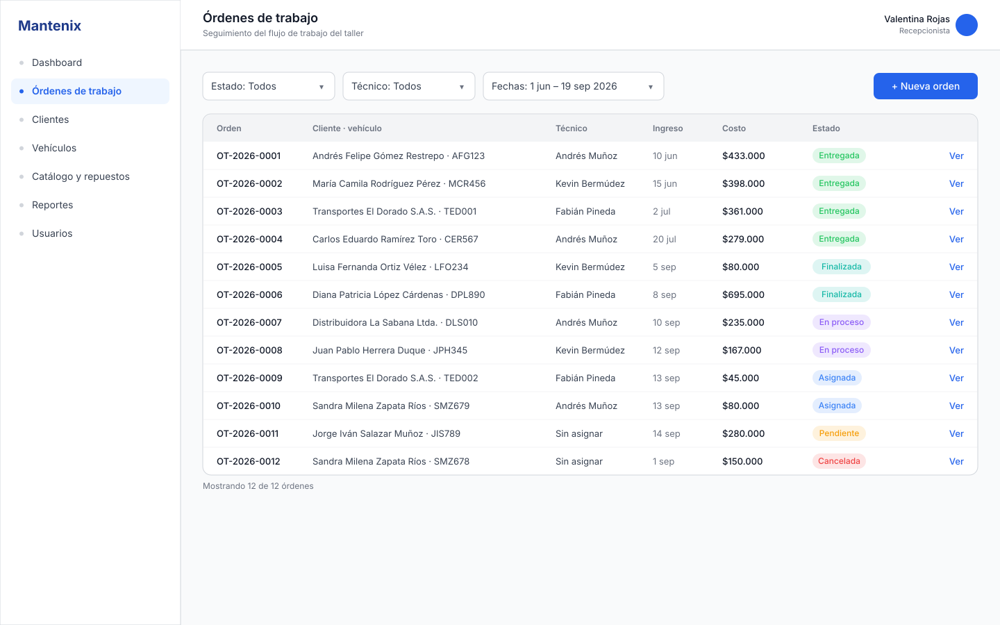
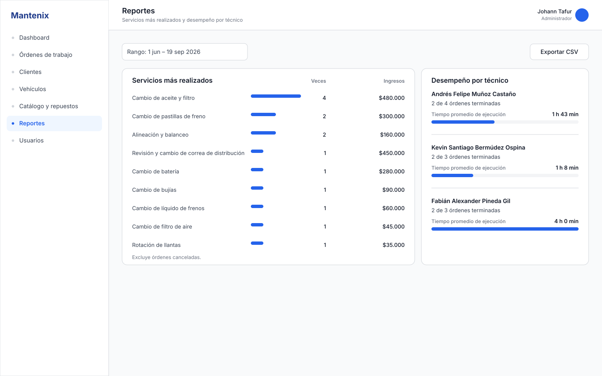
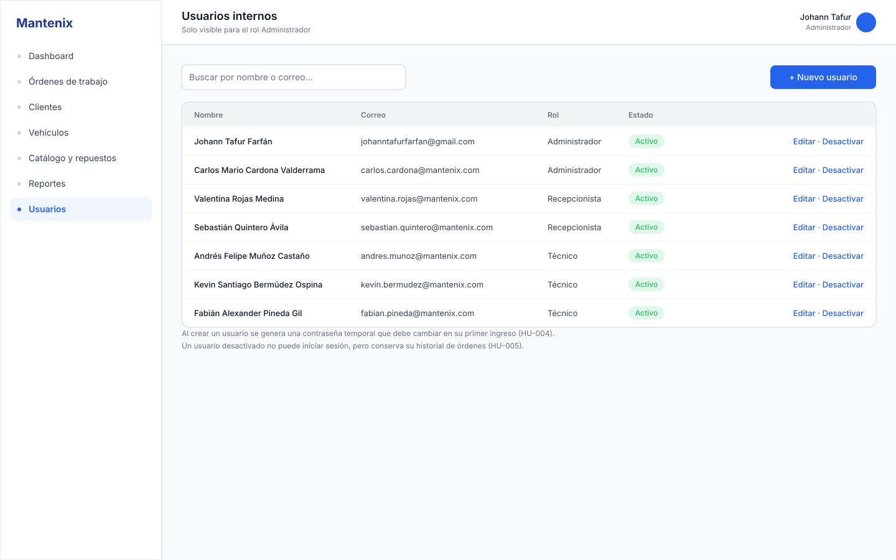
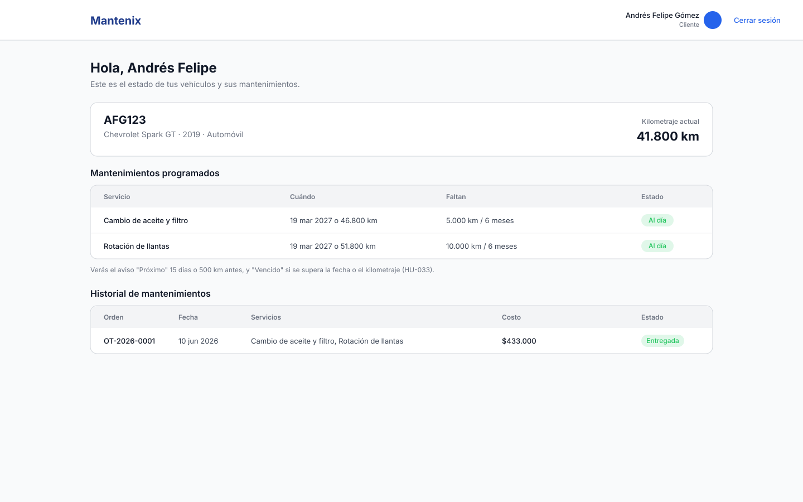
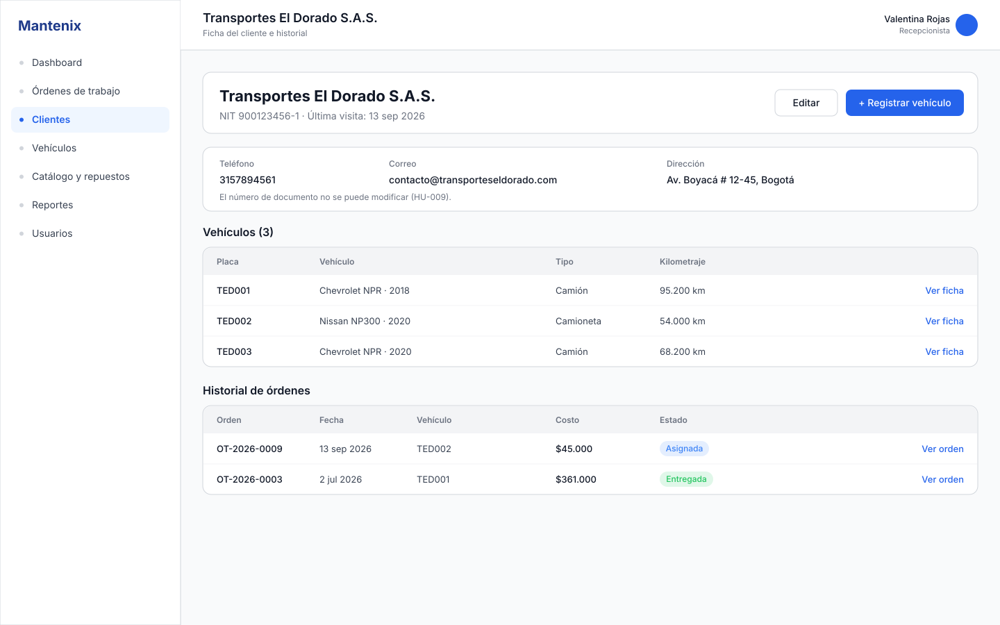
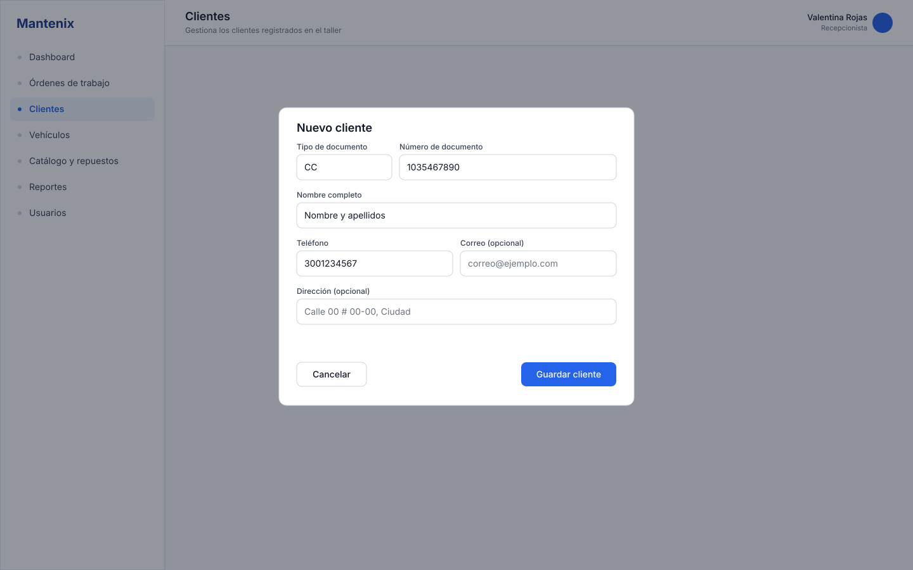
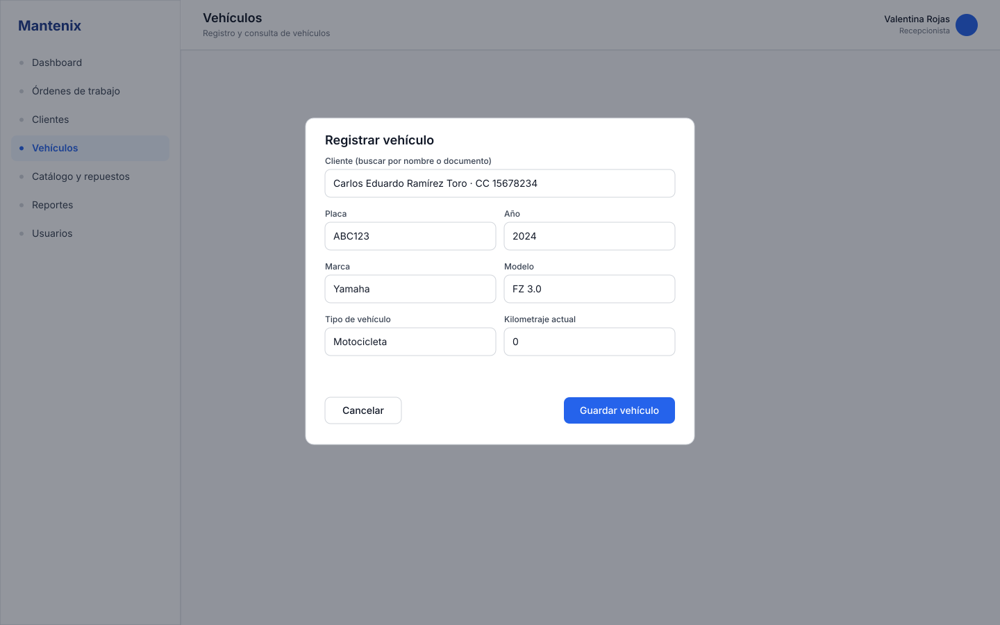
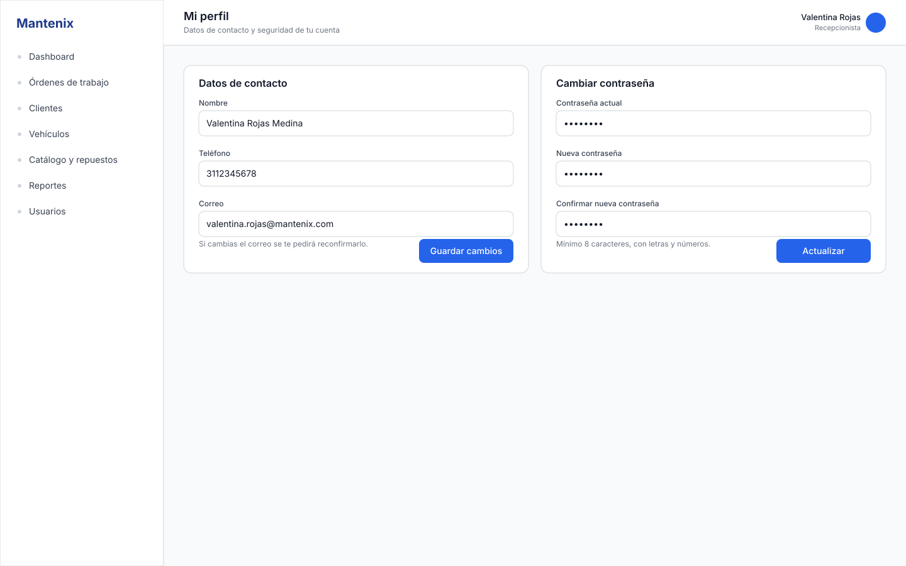
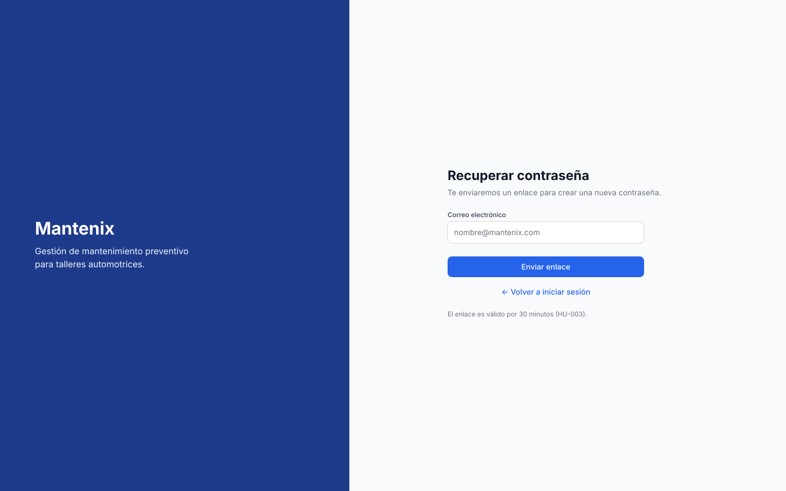

# Mockups de pantallas (SVG)

Pantallas de 1440×900 en el mismo estilo del sistema de diseño de Figma (paleta, tipografía Inter,
componentes Button/Badge/Input/NavItem). Todos los datos salen de [database/seed.sql](../../../database/seed.sql):
mismos clientes, placas, órdenes, precios, stock y fechas, así que las pantallas son coherentes con la base de datos.

Se generaron localmente porque el plan Starter de Figma limita las llamadas del MCP; los SVG se pueden
**arrastrar directamente a Figma** (se importan como capas editables) o usarse como evidencia.

Con estas pantallas y el Login (solo en Figma) quedan cubiertas las 37 historias de usuario.

| Archivo | Pantalla | Historias de usuario |
|---|---|---|
| [02-dashboard.svg](02-dashboard.svg) | Dashboard del administrador | HU-034, HU-035 |
| [03-clientes.svg](03-clientes.svg) | Clientes: listado y búsqueda | HU-008 |
| [04-vehiculo-ficha.svg](04-vehiculo-ficha.svg) | Vehículo: ficha técnica e historial | HU-013, HU-014, HU-015, HU-031, HU-033 |
| [05-crear-orden.svg](05-crear-orden.svg) | Crear orden de trabajo | HU-023, HU-024 |
| [06-detalle-orden.svg](06-detalle-orden.svg) | Detalle de orden con línea de tiempo | HU-021, HU-024 a HU-029 |
| [07a-catalogo-servicios.svg](07a-catalogo-servicios.svg) | Catálogo de servicios | HU-016 a HU-018 |
| [07b-inventario-repuestos.svg](07b-inventario-repuestos.svg) | Inventario de repuestos | HU-019, HU-020, HU-022 |
| [08-ordenes-listado.svg](08-ordenes-listado.svg) | Listado de órdenes con filtros | HU-030 |
| [09-reportes.svg](09-reportes.svg) | Reportes: servicios y técnicos | HU-036, HU-037 |
| [10-usuarios.svg](10-usuarios.svg) | Usuarios internos | HU-004, HU-005 |
| [11-portal-cliente.svg](11-portal-cliente.svg) | Portal del cliente | HU-011, HU-033 |
| [12-ficha-cliente.svg](12-ficha-cliente.svg) | Ficha de cliente e historial | HU-009, HU-010 |
| [13-modal-nuevo-cliente.svg](13-modal-nuevo-cliente.svg) | Modal: nuevo cliente | HU-007 |
| [14-modal-nuevo-vehiculo.svg](14-modal-nuevo-vehiculo.svg) | Modal: registrar vehículo | HU-012 |
| [15-perfil.svg](15-perfil.svg) | Mi perfil y cambio de contraseña | HU-006 |
| [16-recuperar-contrasena.svg](16-recuperar-contrasena.svg) | Recuperar contraseña | HU-003 |

Notas: la barra lateral de estos mockups incluye el ítem **Usuarios** (solo rol Administrador), que
todavía no existe en las pantallas 01 a 03 hechas en Figma. Login (HU-001) y el botón de cerrar sesión
(HU-002, en el topbar y el portal) están en Figma / estos mockups respectivamente.

## Vista previa












## Regenerar

```powershell
.\generar-mockups.ps1
```

El script ([generar-mockups.ps1](generar-mockups.ps1)) contiene los datos y el layout; al cambiar el
seed o el diseño basta con editarlo y volver a ejecutarlo.
