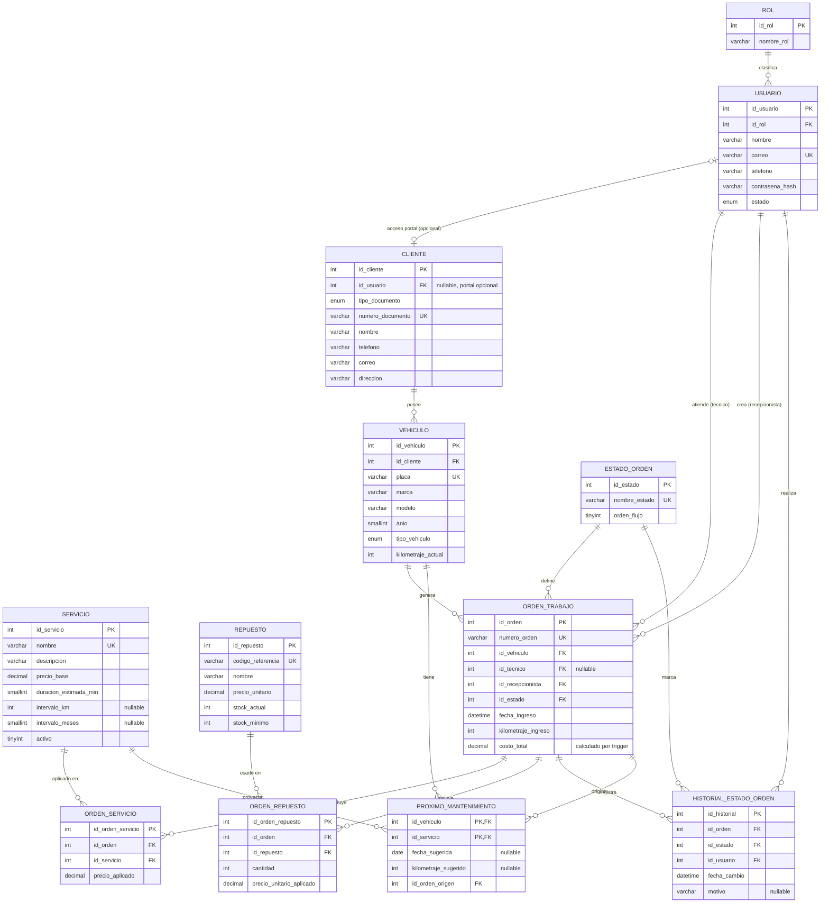

# Modelo entidad-relación — Mantenix

Motor: MySQL 8.4. Ver el script completo en [database/schema.sql](../../database/schema.sql).

## Decisiones de diseño relevantes

- **`usuario` centraliza el login** de los cuatro roles (Administrador, Recepcionista, Técnico, Cliente).
  `cliente` es la entidad de negocio (documento, dirección) y solo se conecta a `usuario` cuando ese
  cliente tiene acceso al portal (HU-011); la mayoría de clientes no lo necesitan, por eso el FK es
  nullable y único (relación 1:1 opcional).
- **`estado_orden` es un catálogo**, no un ENUM embebido, para poder auditar transiciones válidas
  (columna `orden_flujo`) sin alterar la estructura de `orden_trabajo`.
- **`orden_servicio` y `orden_repuesto`** son tablas de detalle (N:M resueltas) que fijan el precio
  aplicado al momento de la orden — el catálogo (`servicio`/`repuesto`) puede cambiar de precio después
  sin alterar órdenes históricas.
- **`costo_total` se mantiene con triggers**, no se calcula en cada consulta: se recalcula
  automáticamente al agregar/quitar un servicio o repuesto (ver `sp_recalcular_costo_orden` y los
  triggers `trg_orden_servicio_*` / `trg_orden_repuesto_*` en `schema.sql`).
- **`stock_actual` de `repuesto`** se descuenta/restituye automáticamente vía trigger cuando se
  agrega o quita un repuesto de una orden (HU-021, HU-029) — nunca se edita a mano desde la aplicación.
- **`proximo_mantenimiento`** guarda el resultado calculado (HU-032), no se recalcula en cada
  consulta; se recalcula solo cuando una orden pasa a estado "Entregada" (trigger
  `trg_orden_trabajo_after_update`). La vista `vista_alertas_mantenimiento` combina ese valor
  con la fecha/kilometraje actual para clasificar el estado en Al día / Próximo / Vencido (HU-033, HU-034).
- **`historial_estado_orden` la alimenta la aplicación**, no un trigger: cada cambio de estado lo hace
  un usuario identificado (HU-025), y ese `id_usuario` no está disponible de forma confiable dentro de
  un trigger de base de datos.
